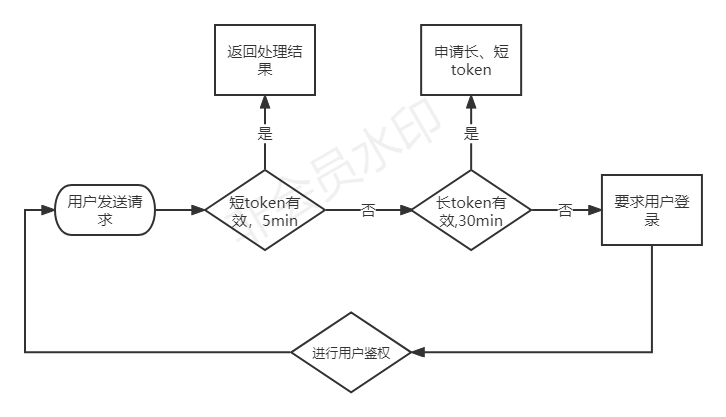

# 在gin框架中使用JWT

发布于2020/03/16 ,更新于2022/05/02 11:52:10 | [Golang](https://www.liwenzhou.com/categories/Golang)

JWT全称JSON Web Token是一种跨域认证解决方案，属于一个开放的标准，它规定了一种Token实现方式，目前多用于前后端分离项目和OAuth2.0业务场景下。

## 什么是JWT？

JWT全称JSON Web Token是一种跨域认证解决方案，属于一个开放的标准，它规定了一种Token 实现方式，目前多用于前后端分离项目和 OAuth2.0 业务场景下。

## 为什么需要JWT？

在之前的一些web项目中，我们通常使用的是 `Cookie-Session`模式实现用户认证。相关流程大致如下：

1. 用户在浏览器端填写用户名和密码，并发送给服务端
2. 服务端对用户名和密码校验通过后会生成一份保存当前用户相关信息的session数据和一个与之对应的标识（通常称为session_id）
3. 服务端返回响应时将上一步的session_id写入用户浏览器的Cookie
4. 后续用户来自该浏览器的每次请求都会自动携带包含session_id的Cookie
5. 服务端通过请求中的session_id就能找到之前保存的该用户那份session数据，从而获取该用户的相关信息。

这种方案依赖于客户端（浏览器）保存 Cookie，并且需要在服务端存储用户的session数据。

在移动互联网时代，我们的用户可能使用浏览器也可能使用APP来访问我们的服务，我们的web应用可能是前后端分开部署在不同的端口，有时候我们还需要支持第三方登录，这下 `Cookie-Session`的模式就有些力不从心了。

JWT就是一种基于Token的轻量级认证模式，服务端认证通过后，会生成一个JSON对象，经过签名后得到一个Token（令牌）再发回给用户，用户后续请求只需要带上这个Token，服务端解密之后就能获取该用户的相关信息了。

想要了解JWT的原理，推荐大家阅读：[阮一峰的JWT入门教程](https://www.ruanyifeng.com/blog/2018/07/json_web_token-tutorial.html)

## 安装

我们使用 Go 语言社区中的 jwt 相关库来构建我们的应用，例如：[https://github.com/golang-jwt/jwt](https://github.com/golang-jwt/jwt)。

本文将使用这个库来实现我们生成JWT和解析JWT的功能。

## 使用

### 默认Claim

如果我们直接使用JWT中默认的字段，没有其他定制化的需求则可以直接使用这个包中的和方法快速生成和解析token。

### 自定义Claims

我们需要定制自己的需求来决定JWT中保存哪些数据，比如我们规定在JWT中要存储 `username`信息，那么我们就定义一个 `MyClaims`结构体如下：

然后我们定义JWT的过期时间，这里以24小时为例：

接下来还需要定义一个用于签名的字符串：

### 生成JWT

我们可以根据自己的业务需要封装一个生成 token 的函数。

### 解析JWT

根据给定的 JWT 字符串，解析出数据。

客户端收到服务器返回的 JWT，可以储存在 Cookie 里面，也可以储存在 localStorage。

此后，客户端每次与服务器通信，都要带上这个 JWT。你可以把它放在 Cookie 里面自动发送，但是这样不能跨域，所以更好的做法是放在 HTTP 请求的头信息 `Authorization`字段里面。

> ```bash
> Authorization: Bearer <token>
> ```

另一种做法是，跨域的时候，JWT 就放在 POST 请求的数据体里面。

## 在gin框架中使用JWT

首先我们注册一条路由 `/auth`，对外提供获取Token的渠道：

我们的 `authHandler`定义如下：

用户通过上面的接口获取Token之后，后续就会携带着Token再来请求我们的其他接口，这个时候就需要对这些请求的Token进行校验操作了，很显然我们应该实现一个检验Token的中间件，具体实现如下：

注册一个 `/home`路由，发个请求验证一下吧。

如果不想自己实现上述功能，你也可以使用Github上别人封装好的包，比如[https://github.com/appleboy/gin-jwt](https://github.com/appleboy/gin-jwt)。

### refresh token

在某些业务场景下，我们可能还需要使用refresh token。

这里可以参考 [RFC 6749 OAuth2.0中关于refresh token的介绍](https://datatracker.ietf.org/doc/html/rfc6749#section-1.5)

### Double token



```

```
